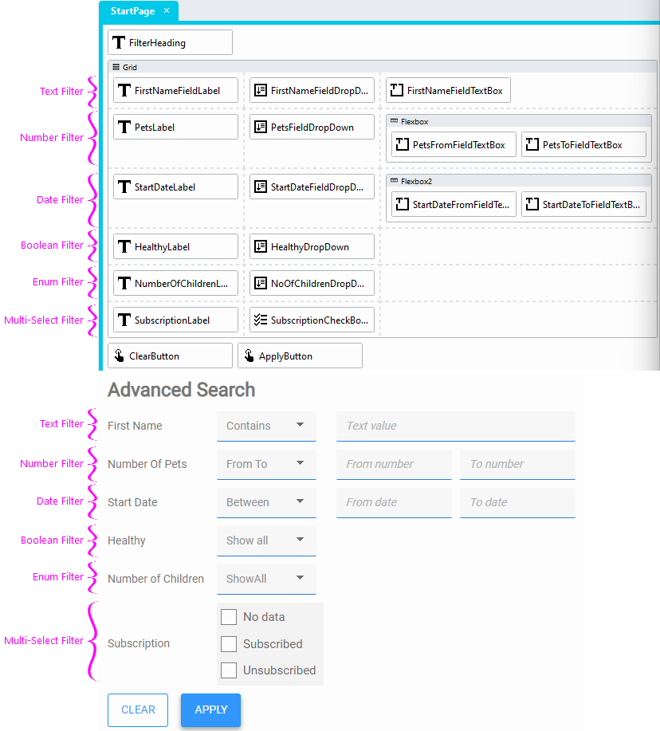
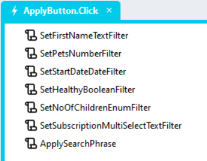

# DataGrid Client Side Filters

Building advanced client-side search forms for DataGrids

https://github.com/stadium-software/datagrid-advanced-search/assets/2085324/5964bf79-e513-4227-9a72-361cee6c0d7b

<hr>

## Version
1.2

### Change Log
1.1 Converted 'Boolean Filter' to a generic 'Enum Filter'. This filter still works for Boolean columns, but can now also be applied to any other column

1.2 Removed non-JS sample application; re-added boolean filter; added muilti-select text filter; simplified implementation

## Sample applications
This repo contains one Stadium 6 application
[ClientSideFilters.sapz](Stadium6/ClientSideFilters.sapz?raw=true)

<hr>

## Application Setup
1. Check the *Enable Style Sheet* checkbox in the application properties
2. Add a variable called "SearchPhrase" to the application variables

## Database, Connector and DataGrid
Use the instructions from [this repo](https://github.com/stadium-software/samples-database) to setup the database and DataGrid for this sample

<hr>

## Filters form

1. Add a Grid control to the page and place it above the DataGrid
2. Add a class entitled "filtergrid" to the grid control classes property
3. Add a button below the grid with the Text "Clear"
4. Add another button below the grid with the Text "Apply"
5. Place controls into the Grid control as shown below



### For Text columns

1. Enter the name of the filter into the label *Text* property (e.g. FirstName)
2. Add any or all of the operators shown below in any order as *values* for the DropDown  *Options* property (assign any text to these options you like)
   1. Contains
   2. DoesNotContain
   3. Equals
   4. NotEquals

### For Number columns

1. Enter the name of the filter into the label *Text* property
2. Add any or all of the operators shown below as *values* for the DropDown  *Options* property (set "From-To" or "Between" as the first option)
   1. From-To
   2. Between
   3. GreaterThan
   4. SmallerThan

### For Date columns

1. Enter the name of the filter into the label *Text* property
2. Add any or all of the operators shown below as *values* for the DropDown  *Options* property (set "Between" as the first option)
   1. Between
   2. GreaterThan
   3. SmallerThan

### Enum Filter

1. Enter the name of the filter into the label *Text* property
2. Add "ShowAll" as the first value in the filter dropdown
3. Add any number of text values you want people to select from as *values* for the DropDown *Options* property (e.g. a list of statuses) 
4. You can populate this dropdown from a data source, such as a query or API call

### Boolean columns

1. Enter the name of the filter into the label *Text* property
2. Add the values as *values* in the DropDown *Options* property
   1. "ShowAll"
   2. "Yes"
   3. "No"

### Multi-Select Filter

1. Enter the name of the filter into the label *Text* property
2. Add any number of text values you want people to select from as *values* for the CheckBoxList *Options* property (e.g. a list of statuses) 
3. You can populate this dropdown from a data source, such as a query or API call

<hr>

## Global scripts

Create six global scripts listed below as per the attached sample application. 

NOTES: If you are using Stadium 6.6 or later, you can just copy the global scripts from the [sample application](Stadium6/ClientSideFilters.sapz?raw=true) into your own. Otherwise you will need to recreate these scripts in your application. 

1. ApplySearchPhrase: Applies the search phrase to the DataGrid
2. ClearFilters: Resets the filter form
3. InitialiseFilters: Initialises the clear filter function
4. ReturnVisibleState: Checks the operator and returns a boolean to set the visibility of the "To" value TextBox of Number and Date filters
5. SetBooleanFilter: Creates a search phrase for a ShowAll/Yes/No boolean filter
6. SetDateFilter: Creates a search phrase for a date filter
7. SetEnumFilter: Creates a search phrase for a value selected from a dropdown
8. SetMultiSelectFilter: Creates a search phrase for a checkbox list filter
9. SetNumberFilter: Creates a search phrase for a number filter
10. SetPhraseSession: Saves the search phrase to a session variable
11. SetTextFilter: Creates a search phrase for a text filter

<hr>

## Page.Load event handler

1. Populate your datagrid with data
2. Populate any enum or multi-select filters with data
3. Drag the *InitialiseFilters* script into the event handler

## Apply button event handler

1. Add a *Click* event handler for the "Apply" button

For **every filter** in the grid
1. Add the global script that corresponds with the column data type 
2. Set the parameters required by the script
   1. ColumnHeading: The heading of the DataGrid column the filter needs to be applied to as it appears in the "Header Text" property of that column or in the Heading row of the rendered DataGrid (NOTE: DataGrid headings might contain spaces that the corresponding Database columns do not contain)
   2. Operator: The value of the "operator" DropDown of the filter
   3. Values: 
      1. For Text fields: value of the *TextBox*
      2. For Number and Date Fields: The values of the From and To *TextBoxes*
      3. For Enums: The value of the *DropDown* control of the filter
      4. For Booleans: The value of the *DropDown* control of the filter
      5. For Multi-Selects: The *SelectedOptions* of the *CheckboxList* 
3. After all filter-specific script calls, add the "ApplySearchPhrase" script



## Clear button event handler

1. Add a *Click* event handler for the "Clear" button
2. Drag the *ClearFilters* script into the event handler

## For all Number and Date filters

1. Create a "Change" event handler for the operator DropDown control
2. Drag the *ReturnVisible* script into the event handler
3. Add the value of the operator DropDown into the *SelectedOperatorValue* property
4. Drag a *SetValue* control under the script call
5. Set the "To" field for the filter (e.g. StartDateToField) to the return value of the script

## Styling

1. Add a class called "lite-button" to the Clear button classes property
2. Copy the CSS below into your StyleSheet
3. To change the width of the dropdowns, adjust the *.filtergrid select* width property in the CSS as you see fit 

```
.lite-button button {
	background-color: white;
	color:#3399ff; 
	box-shadow: none;
}
.lite-button button:hover {
	background-color: white;
	color:#3399ff; 
}
.filtergrid select {
	width: 125px;
}
```

<hr>

# Optional Custom Development
1. Allowing users to save searches to the database (save generated search phase)
2. Providing a dropdown for users to apply previously saved searches (populate search field with previously saved phrase)
