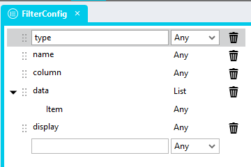
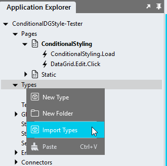
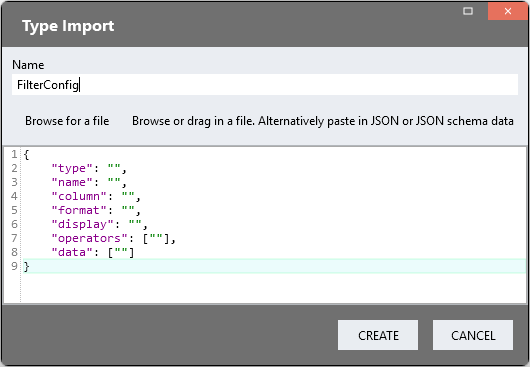
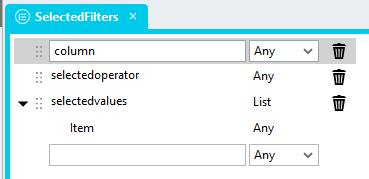
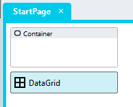
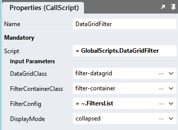
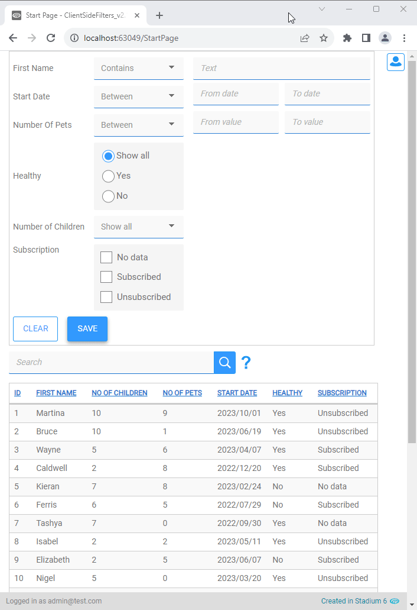
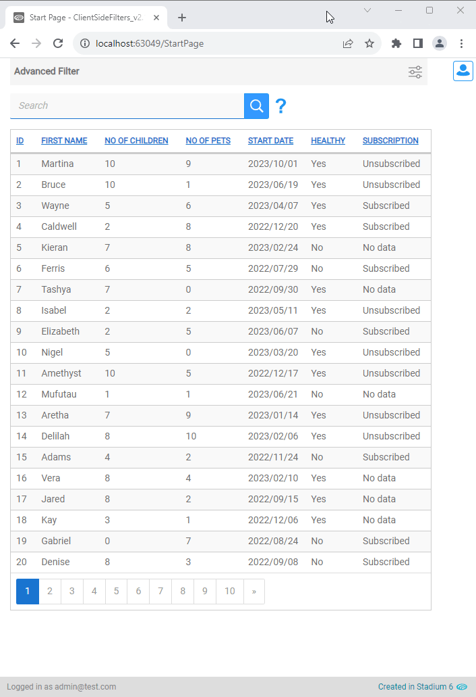
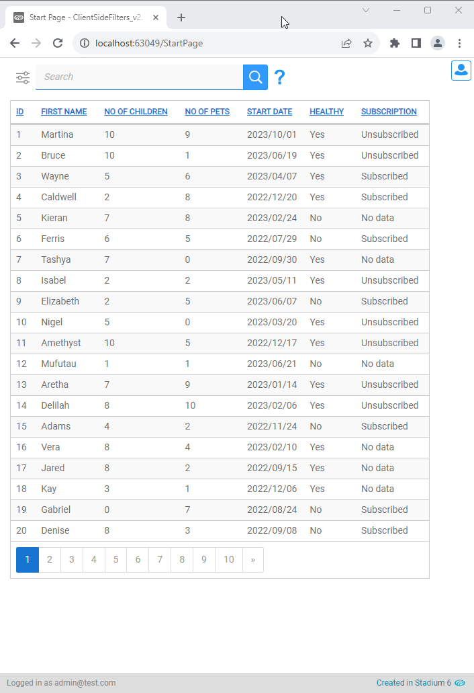

# DataGrid Client Side Filters <!-- omit in toc -->

Generates advanced client-side search forms for DataGrids and populates the DataGrid search box. 

For new implementations, please rather use the [Filter Grid Generator](https://github.com/stadium-software/filter-grid). 

https://github.com/user-attachments/assets/ae38a2ce-3b95-4696-b145-a8798844e743

## Content <!-- omit in toc -->
1. [Version](#version)
   1. [Change Log](#change-log)
2. [Application Setup](#application-setup)
3. [Database, Connector and DataGrid](#database-connector-and-datagrid)
4. [Global Script Setup](#global-script-setup)
5. [Types](#types)
   1. [FilterConfig Type Setup (Required)](#filterconfig-type-setup-required)
      1. [Manual Type Creation](#manual-type-creation)
      2. [Type Import](#type-import)
   2. [SelectedFilters Type Setup (Optional)](#selectedfilters-type-setup-optional)
      1. [Manual Type Creation](#manual-type-creation-1)
      2. [Type Import](#type-import-1)
6. [Page Setup](#page-setup)
7. [Page.Load Setup](#pageload-setup)
8. [Display Modes](#display-modes)
   1. [Default](#default)
   2. [Collapsed](#collapsed)
   3. [Integrated](#integrated)
9. [Callback Script Setup](#callback-script-setup)
10. [Programatically Applying Filters](#programatically-applying-filters)
11. [CSS](#css)
    1. [Before v6.12](#before-v612)
    2. [Customising CSS](#customising-css)
12. [Upgrading Stadium Repos](#upgrading-stadium-repos)

## Version
Version 3.4

### Change Log
3.0 Bug fixes and enhancements
1. Enable enter key press to search when focus is in a value field
2. Optional 'operator' list property in 'FilterConfig' type to limit field operators for text, number & date filters
3. Added "From-To" operator for date fields
4. Fixed "picker" filter date not showing bug
5. Fixed "Between" dates bug
6. Made "From-To" the default operator for dates and numbers

3.0.1 Bug fix 'equals' operator

3.2 Enhancements
1. Added 'Callback' parameter; when provided this script returns applied filters to the callback script
2. Added 'SelectedFilters' parameter to apply filters programatically

3.2.1 Adjusted date filtering logic to cater for datetime columns

3.2.2 Bug fix: SelectedFilters 'To' field not hidden; Collapsed FilterHeading not used bug fix; CollapseOnClickAway not used bug fix

3.2.3 Bug fix: SelectedFilters not populating date field when display is 'picker'

3.2.3(1): Converted px to rem (css only)

3.2.4: Adjusted display width for enum, boolean, radiobuttonlist and checkboxlist displays

3.3 Fixed reinitialise bug

3.3.1 Fixed duplicate header on script recall bug

3.4 Integrated CSS with the script

## Application Setup
1. Check the *Enable Style Sheet* checkbox in the application properties

## Database, Connector and DataGrid
Use the instructions from [this repo](https://github.com/stadium-software/samples-database) to setup the database and DataGrid for this sample

## Global Script Setup
1. Create a Global Script and name it "DataGridFilter"
2. Add the input parameters below to the script
   1. DataGridClass
   2. DisplayMode
   3. FilterConfig
   4. FilterContainerClass
   5. FilterHeading
   6. CollapseOnClickAway
   7. Callback
   8. SelectedFilters
3. Drag a Javascript action into the script and paste the Javascript below into the action
4. Do not make any changes to any of this script
```javascript
/* Stadium Script v3.4 https://github.com/stadium-software/datagrid-advanced-search */
let scope = this;
let filterClassName = "." + ~.Parameters.Input.FilterContainerClass;
let classInput = ~.Parameters.Input.DataGridClass;
if (typeof classInput == "undefined") {
    console.error("The DataGridClass parameter is required");
    return false;
}
let dgClassName = "." + classInput;
let filterConfig = ~.Parameters.Input.FilterConfig;
let callback = ~.Parameters.Input.Callback;
let selectedFilters = ~.Parameters.Input.SelectedFilters || [];
let displayMode = ~.Parameters.Input.DisplayMode;
if (displayMode) displayMode = displayMode.toLowerCase();
let filterHeading = ~.Parameters.Input.FilterHeading;
let dismissClick = ~.Parameters.Input.CollapseOnClickAway == "false" || ~.Parameters.Input.CollapseOnClickAway == false ? false : true;
const insert = (arr, index, newItem) => [...arr.slice(0, index), newItem, ...arr.slice(index)];
let numberSelectChange = (e) => {
    let target = e.target;
    let toEl = target.closest("div").nextElementSibling.querySelector(".filtergrid-to-number");
    let fromEl = target.closest("div").nextElementSibling.querySelector(".filtergrid-from-number");
    if (target.value != "Between" && target.value != "From-To") {
        toEl.classList.add("visually-hidden");
        toEl.value = "";
        fromEl.setAttribute("placeholder", "Value");
    } else { 
        toEl.classList.remove("visually-hidden");
        fromEl.setAttribute("placeholder", "From value");
    }
};
let dateSelectChange = (e) => {
    let target = e.target;
    let toEl = target.closest("div").nextElementSibling.querySelector(".filtergrid-to-date");
    let fromEl = target.closest("div").nextElementSibling.querySelector(".filtergrid-from-date");
    let targetVal = target.value.toLowerCase();
    if (targetVal == "greater than" || targetVal == "smaller than" || targetVal == "equals") {
        toEl.classList.add("visually-hidden");
        toEl.value = "";
        fromEl.setAttribute("placeholder", "Date");
    } else { 
        toEl.classList.remove("visually-hidden");
        fromEl.setAttribute("placeholder", "From date");
    }
};
let tries = 0;
let wait = async (milliseconds) => new Promise((resolve) => setTimeout(resolve, milliseconds));
let dg = document.querySelectorAll(dgClassName);
if (dg.length == 0) {
    console.error("The class '" + dgClassName + "' is not assigned to any DataGrid");
    return false;
} else if (dg.length > 1) {
    console.error("The class '" + dgClassName + "' is assigned to multiple DataGrids. DataGrids using this script must have unique classnames");
    return false;
}
dg = dg[0];
dg.classList.add("stadium-filtered-datagrid");
let getObjectName = (obj) => {
    let objname = obj.id.replace("-container","");
    do {
        let arrNameParts = objname.split(/_(.*)/s);
        objname = arrNameParts[1];
    } while ((objname.match(/_/g) || []).length > 0 && !scope[`${objname}Classes`]);
    return objname;
};
let datagridname = getObjectName(dg);
let dataGridColumns = getColumnDefinition();
let filterContainer = document.querySelectorAll(filterClassName);
if (filterContainer.length == 0) {
    console.error("The container for the filter was not found. Drag a container control into the page and assign the class '" + filterClassName + "' to it.");
    return false;
} else if (filterContainer.length > 1) {
    console.error("The class '" + filterClassName + "' is assigned to multiple controls. Assign a unique classname to the filter container");
    return false;
}
filterContainer = filterContainer[0];
let filterHeader = filterContainer.querySelector(".stadium-filter-header");
if (filterHeader && displayMode == "collapsed"){
    filterHeader.remove();
}
let filterInnerContainer = filterContainer.querySelector(".stadium-filter-inner-container");
if (filterInnerContainer){
    filterInnerContainer.remove();
}
filterContainer.classList.add("stadium-filter-container");
filterInnerContainer = document.createElement("div");
filterInnerContainer.classList.add("stadium-filter-inner-container");
filterContainer.appendChild(filterInnerContainer);
let stadiumFilters = document.createElement("div");
stadiumFilters.classList.add("stadium-filters");
stadiumFilters.setAttribute("forDG",dg.id);
filterInnerContainer.appendChild(stadiumFilters);
loadCSS();
initFilterForm();

if (selectedFilters.length > 0) {
    setSelectedFilters();
}

function initFilterForm() {
    if (displayMode == "integrated" || displayMode == "collapsed") {
        let filterHeader = document.createElement("div");
        filterHeader.classList.add("stadium-filter-header");
        filterInnerContainer.before(filterHeader);
        filterHeader.addEventListener("click", function (e) {
            e.target.closest(".stadium-filter-container").classList.toggle("expand");
        });
        if (displayMode == "integrated") { 
            filterContainer.classList.add("filter-integrated");
            let datagridheader = dg.querySelector(".data-grid-header");
            if (datagridheader.querySelector("div")) {
                datagridheader.querySelector("div:nth-child(1)").before(filterContainer);
            } else { 
                datagridheader.appendChild(filterContainer);
            }
        } else if (displayMode == "collapsed") { 
            filterHeader.textContent = filterHeading;
            filterContainer.classList.add("filter-collapsed");
        }
    }
    for (let i = 0; i < filterConfig.length; i++) {
        let column = filterConfig[i].column;
        let columnDef, colNo;
        if (!isNumber(column)) {
            columnDef = getElementFromObjects(dataGridColumns, column, "name");
            if (!columnDef) {
                console.error("Column '" + column + "' was not found. The 'column' property must contain the column name exactly as defined in the DataGrid 'Columns' property or the column number.");
                continue;
            }
            colNo = dataGridColumns.map(function (e) {return e.name;}).indexOf(columnDef.name) + 1;
        } else {
            colNo = column;
            columnDef = dataGridColumns[column - 1];
            if (!columnDef) {
                console.error("Column '" + column + "' was not found.");
                continue;
            }
            column = columnDef.name;
        }
        if (columnDef.visible == false) {
            console.error("Column '" + column + "' is not visible. Only visible columns can be used. ");
            continue;
        }
        if (!colNo || !columnDef.headerText) {
            if (!columnDef.headerText) {
                console.error("Column '" + columnDef.name + "' has no header text. Filter columns must have a header text.");
            }
            continue;
        }

        let type = filterConfig[i].type;
        let name = filterConfig[i].name;
        let data = filterConfig[i].data;
        let display = filterConfig[i].display;
        let format = filterConfig[i].format;
        let operators = filterConfig[i].operators || [];
        operators = operators.map(v => v.toLowerCase());

        let label = document.createElement("div");
        label.classList.add("control-container","label-container");
        let labelInner = document.createElement("span");
        labelInner.textContent = name;
        label.appendChild(labelInner);

        let operator = document.createElement("div");
        let valueField = document.createElement("div");
        let select, input;

        if (type == "text") {
            select = document.createElement("select");
            let options = ["Contains", "Does not contain", "Equals", "Does not equal"];
            for (let s = 0; s < options.length; s++) {
                let opt = options[s];
                if (operators.includes(opt.toLowerCase()) || operators.length == 0) {
                    let el = document.createElement("option");
                    el.textContent = opt;
                    el.value = opt;
                    select.appendChild(el);
                }
            }
            if (operators.length == 1) select.setAttribute("readonly", "readonly");
            select.classList.add("form-control", "filter-operator");
            operator.classList.add("control-container", "drop-down-container");
            input = document.createElement("input");
            input.classList.add("form-control", "text-box-input", "filtergrid-text-value");
            input.setAttribute("placeholder", "Text");
            input.addEventListener("keypress", applyOnKeypress);
            valueField.classList.add("control-container", "text-box-container");
        }
        if (type == "number") {
            select = document.createElement("select");
            let options = ["From-To", "Between", "Equals", "Greater than", "Smaller than"];
            for(let s = 0; s < options.length; s++) {
                let opt = options[s];
                if (operators.includes(opt.toLowerCase()) || operators.length == 0) {
                    let el = document.createElement("option");
                    el.textContent = opt;
                    el.value = opt;
                    select.appendChild(el);
                }
            }
            if (operators.length == 1) select.setAttribute("readonly", "readonly");
            select.classList.add("form-control", "filter-operator");
            operator.classList.add("control-container", "drop-down-container");
            let numInput1 = document.createElement("input");
            numInput1.classList.add("form-control", "text-box-input", "filtergrid-from-number");
            numInput1.setAttribute("placeholder", "From value");
            numInput1.addEventListener("keypress", applyOnKeypress);
            let numInput2 = document.createElement("input");
            numInput2.classList.add("form-control", "text-box-input", "filtergrid-to-number");
            numInput2.setAttribute("placeholder", "To value");
            numInput2.addEventListener("keypress", applyOnKeypress);
            input = document.createElement("div");
            input.classList.add("number-values");
            select.addEventListener("change", numberSelectChange);
            input.appendChild(numInput1);
            input.appendChild(numInput2);
        }
        if (type == "date") {
            if (!format) format = 'YYYY/MM/DD';
            select = document.createElement("select");
            let options = ["From-To", "Between", "Equals", "Greater than", "Smaller than"];
            for(let s = 0; s < options.length; s++) {
                let opt = options[s];
                if (operators.includes(opt.toLowerCase()) || operators.length == 0) {
                    let el = document.createElement("option");
                    el.textContent = opt;
                    el.value = opt;
                    select.appendChild(el);
                }
            }
            if (operators.length == 1) select.setAttribute("readonly", "readonly");
            select.classList.add("form-control", "filter-operator");
            operator.classList.add("control-container", "drop-down-container");
            let dtInput1 = document.createElement("input");
            dtInput1.classList.add("form-control", "text-box-input", "filtergrid-from-date");
            dtInput1.setAttribute("placeholder", "From date");
            dtInput1.setAttribute("format", format);
            dtInput1.addEventListener("keypress", applyOnKeypress);
            let dtInput2 = document.createElement("input");
            dtInput2.classList.add("form-control", "text-box-input", "filtergrid-to-date");
            dtInput2.setAttribute("placeholder", "To date");
            dtInput2.addEventListener("keypress", applyOnKeypress);
            if (display == "picker") {
                dtInput1.type = "date";
                dtInput2.type = "date";
            }
            input = document.createElement("div");
            input.classList.add("date-values");
            select.addEventListener("change", dateSelectChange);
            input.appendChild(dtInput1);
            input.appendChild(dtInput2);
        }
        if (type == "boolean") {
            let options = ["Show all", "Yes", "No"];
            if (display == "radio") {
                select = document.createElement("div");
                for (let s = 0; s < options.length; s++) {
                    let cont = document.createElement("div");
                    cont.classList.add("radio");
                    let opt = options[s];
                    let el = document.createElement("input");
                    let lab = document.createElement("label");
                    el.type = "radio";
                    el.name = column;
                    el.checked = false;
                    if (opt == "Show all") el.checked = true;
                    el.value = opt;
                    lab.textContent = opt;
                    let fid = column + "_" + opt;
                    el.id = fid.replaceAll(" ", "").toLowerCase();
                    lab.setAttribute("for", el.id);
                    cont.appendChild(el);
                    cont.appendChild(lab);
                    select.appendChild(cont);
                }
                operator.classList.add("control-container", "radio-button-list-container", "filtergrid-radiobutton-list", "span-2");
            } else {
                select = document.createElement("select");
                for(let s = 0; s < options.length; s++) {
                    let opt = options[s];
                    let el = document.createElement("option");
                    el.textContent = opt;
                    el.value = opt;
                    select.appendChild(el);
                }
                select.classList.add("form-control");
                operator.classList.add("control-container", "drop-down-container", "filtergrid-boolean-operator", "span-2");
            }
            input = document.createElement("div");
            valueField.classList.add("no-display");
        }
        if (type == "enum") {
            data = insert(data, 0, "Show all");
            if (display == "radio") {
                select = document.createElement("div");
                for (let s = 0; s < data.length; s++) {
                    let cont = document.createElement("div");
                    cont.classList.add("radio");
                    let opt = data[s];
                    let el = document.createElement("input");
                    let lab = document.createElement("label");
                    el.type = "radio";
                    el.name = column;
                    el.checked = false;
                    if (opt == "Show all") el.checked = true;
                    el.value = opt;
                    lab.textContent = opt;
                    let fid = column + "_" + opt;
                    el.id = fid.replaceAll(" ", "").toLowerCase();
                    lab.setAttribute("for", el.id);
                    cont.appendChild(el);
                    cont.appendChild(lab);
                    select.appendChild(cont);
                }
                operator.classList.add("control-container", "radio-button-list-container", "filtergrid-radiobutton-list", "span-2");
            } else {
                select = document.createElement("select");
                for (let s = 0; s < data.length; s++) {
                    let opt = data[s];
                    let el = document.createElement("option");
                    el.textContent = opt;
                    el.value = opt;
                    select.appendChild(el);
                }
                select.classList.add("form-control");
                operator.classList.add("control-container", "drop-down-container", "filtergrid-enum-operator", "span-2");
            }
            input = document.createElement("div");
            valueField.classList.add("no-display");
        }
        if (type == "multiselect") {
            select = document.createElement("div");
            for (let s = 0; s < data.length; s++) {
                let cont = document.createElement("div");
                cont.classList.add("checkbox");
                let opt = data[s];
                let el = document.createElement("input");
                let lab = document.createElement("label");
                el.type = "checkbox";
                el.checked = false;
                el.value = opt;
                lab.textContent = opt;
                let fid = column + "_" + opt;
                el.id = fid.replaceAll(" ", "").toLowerCase();
                lab.setAttribute("for", el.id);
                cont.appendChild(el);
                cont.appendChild(lab);
                select.appendChild(cont);
            }
            operator.classList.add("control-container", "check-box-list-container", "filtergrid-checkbox-list", "span-2");
            input = document.createElement("div");
            valueField.classList.add("no-display");
        }
        setAttributes(operator, { "foperator": column, "ftype": type, "cno": colNo, "fdisplay": display });
        operator.appendChild(select);

        setAttributes(valueField, { "fvalue": column, "ftype": type, "cno": colNo, "fdisplay": display });
        valueField.appendChild(input);

        stadiumFilters.appendChild(label);
        stadiumFilters.appendChild(operator);
        stadiumFilters.appendChild(valueField);
        select.dispatchEvent(new Event('change'));
    }
    let buttonBar = document.createElement("div"); buttonBar.classList.add("filter-button-bar");

    let clearButton = document.createElement("button");
    clearButton.textContent = "Clear";
    clearButton.classList.add("lite-button", "btn", "btn-lg", "btn-default");
    clearButton.addEventListener("click", clearForm);
    let clearButtonContainer = document.createElement("div");
    clearButtonContainer.classList.add("control-container", "button-container");
    clearButtonContainer.appendChild(clearButton);
    buttonBar.appendChild(clearButtonContainer);

    let saveButton = document.createElement("button");
    saveButton.textContent = "Apply";
    saveButton.classList.add("btn", "btn-lg", "btn-default", "apply-button");
    saveButton.addEventListener("click", filterDataGrid);
    let saveButtonContainer = document.createElement("div");
    saveButtonContainer.classList.add("control-container", "button-container");
    saveButtonContainer.appendChild(saveButton);
    buttonBar.appendChild(saveButtonContainer);

    stadiumFilters.appendChild(buttonBar);
    if (dismissClick) {
        document.body.addEventListener("click", function (e) {
            if (!e.target.closest(filterClassName)) {
                let allFilters = document.querySelectorAll(filterClassName);
                for (let i = 0; i < allFilters.length; i++) {
                    allFilters[i].classList.remove("expand");
                }
            }
        });
    }
}

async function filterDataGrid(){
    let searchPhrase = [];
    let arrReturn = [];
    let operatorEls = stadiumFilters.querySelectorAll("[foperator]");
    for (let i = 0; i < operatorEls.length; i++) {
        let ftype = operatorEls[i].getAttribute("ftype");
        let colNo = operatorEls[i].getAttribute("cno");
        let fdisplay = operatorEls[i].getAttribute("fdisplay");
        let foperator = operatorEls[i].getAttribute("foperator");
        let colText = dataGridColumns[colNo - 1].headerText;
        let fvalueEl = operatorEls[i].nextElementSibling;
        let output, heading = "";
        if (colText) heading = colText.replaceAll(" ", "\\ ");
        if (ftype == "text") {
            let txtoperator = operatorEls[i].querySelector("select").value;
            let txtvalue = fvalueEl.querySelector("input").value;
            if (txtoperator == "Contains" && txtvalue) {
                output = heading + ':"' + txtvalue + '"';
            } else if (txtoperator.toLowerCase() == "does not contain" && txtvalue) {
                output = heading + ':(NOT "' + txtvalue + '")';
            } else if (txtoperator.toLowerCase() == "equals" && txtvalue) {
                output = heading + ':["' + txtvalue + '" TO "' + txtvalue + '"]';
            } else if (txtoperator.toLowerCase() == "does not equal" && txtvalue) {
                output = heading + ':(NOT ["' + txtvalue + '" TO "' + txtvalue + '"])';
            }
            if (txtvalue) arrReturn.push({"column": foperator, "selectedoperator":txtoperator, selectedvalues: [txtvalue]});
        }
        if (ftype == "number") {
            let numoperator = operatorEls[i].querySelector("select").value;
            let numvaluefromEl = fvalueEl.querySelector(".filtergrid-from-number");
            let numvaluetoEl = fvalueEl.querySelector(".filtergrid-to-number");
            let numvaluefrom = numvaluefromEl.value;
            let numvalueto = numvaluetoEl.value;
            if (numvaluefrom) {
                if (!numvaluefrom) numvaluefrom = -9007199254740991;
                if (!numvalueto) numvalueto = 9007199254740991;
                numvaluefromEl.value = numvaluefrom;
                numvaluetoEl.value = numvalueto;
                if (numoperator.toLowerCase() == "between") {
                    output = heading + ':{' + numvaluefrom + ' TO ' + numvalueto + '}';
                } else if (numoperator.toLowerCase() == "from-to") {
                    output = heading + ':[' + numvaluefrom + ' TO ' + numvalueto + ']';
                } else if (numoperator.toLowerCase() == "equals") {
                    output = heading + ':[' + numvaluefrom + ' TO ' + numvaluefrom + ']';
                } else if (numoperator.toLowerCase() == "greater than") {
                    output = heading + ':{' + numvaluefrom + ' TO 9007199254740991}';
                } else if (numoperator.toLowerCase() == "smaller than") {
                    output = heading + ':{-9007199254740991 TO ' + numvaluefrom + '}';
                }
                arrReturn.push({"column": foperator, "selectedoperator":numoperator, selectedvalues: [numvaluefrom, numvalueto]});
            }
        }
        if (ftype == "date") {
            let dtoperator = operatorEls[i].querySelector("select").value;
            let fromEl = fvalueEl.querySelector(".filtergrid-from-date");
            let toEl = fvalueEl.querySelector(".filtergrid-to-date");
            let format = fromEl.getAttribute("format");
            if (fromEl.value) {
                let dtvaluefrom = dayjs(fromEl.value).format(format);
                let dtvalueto = dayjs(toEl.value).format(format);
                if (dtvaluefrom == "Invalid Date") dtvaluefrom = dayjs('1000/01/01').format(format);
                if (dtvalueto == "Invalid Date") dtvalueto = dayjs('3000/01/01').format(format);
                if (fromEl.type == "date") {
                    fromEl.value = dayjs(dtvaluefrom).format('YYYY-MM-DD');
                    toEl.value = dayjs(dtvalueto).format('YYYY-MM-DD');
                } else {
                    fromEl.value = dtvaluefrom;
                    toEl.value = dtvalueto;
                }
                if (dtoperator.toLowerCase() == "between") {
                    output = heading + ':{' + dtvaluefrom + ' TO ' + dtvalueto + '}';
                } else if (dtoperator.toLowerCase() == "from-to") {
                    output = heading + ':{' + dayjs(dtvaluefrom).add(-1, 'day').format(format) + ' TO ' + dayjs(dtvalueto).add(1, 'day').format(format) + '}';
                } else if (dtoperator.toLowerCase() == "equals") {
                    output = heading + ':{' + dayjs(dtvaluefrom).add(-1, 'day').format(format) + ' TO ' + dayjs(dtvaluefrom).add(1, 'day').format(format) + '}';
                } else if (dtoperator.toLowerCase() == "greater than") {
                    output = heading + ':{' + dayjs(dtvaluefrom).add(1, 'day').format(format) + ' TO ' + dayjs('3000/01/01').format(format) + '}';
                } else if (dtoperator.toLowerCase() == "smaller than") {
                    output = heading + ':{' + dayjs('1000/01/01').format(format) + ' TO ' + dtvaluefrom + '}';
                }
                arrReturn.push({"column": foperator, "selectedoperator":dtoperator, selectedvalues: [dtvaluefrom, dtvalueto]});
            }
        }
        let selectedvals = [];
        if (ftype == "boolean" && fdisplay == "radio") {
            let multioperator = operatorEls[i].querySelectorAll("input[type='radio']");
            for (let s = 0; s < multioperator.length; s++) {
                if (multioperator[s].checked && multioperator[s].value != "Show all") {
                    output = heading + ':' + multioperator[s].value;
                    selectedvals.push(multioperator[s].value);
                }
            }
        } else if (ftype == "boolean") {
            let booloperator = operatorEls[i].querySelector("select").value;
            if (booloperator != "Show all" && booloperator != "") {
                output = heading + ':' + booloperator;
                selectedvals.push(booloperator);
            }
        }
        if (ftype == "enum" && fdisplay == "radio") {
            let multioperator = operatorEls[i].querySelectorAll("input[type='radio']");
            for (let s = 0; s < multioperator.length; s++) {
                if (multioperator[s].checked && multioperator[s].value != "Show all") {
                    output = heading + ':["' + multioperator[s].value + '" TO "' + multioperator[s].value + '"]';
                    selectedvals.push(multioperator[s].value);
                }
            }
        } else if (ftype == "enum") {
            let enumoperator = operatorEls[i].querySelector("select").value;
            if (enumoperator != "Show all" && enumoperator != "") {
                output = heading + ':["' + enumoperator + '" TO "' + enumoperator + '"]';
                selectedvals.push(enumoperator);
            }
        }
        if (ftype == "multiselect") {
            let multioperator = operatorEls[i].querySelectorAll("input[type='checkbox']");
            let or = "";
            output = "(";
            for (let s = 0; s < multioperator.length; s++) {
                if (multioperator[s].checked) {
                    output += or + heading + ':["' + multioperator[s].value + '" TO "' + multioperator[s].value + '"]';
                    or = " OR ";
                    selectedvals.push(multioperator[s].value);
                }
            }
            output += ")";
        }
        if (selectedvals.length > 0) arrReturn.push({"column": foperator, selectedvalues: selectedvals});
        if (output && output != "()") searchPhrase.push(output);
    }
    filterContainer.classList.remove("expand");
    scope[`${datagridname}SearchTerm`] = searchPhrase.join(' AND ');
    if (callback) {
        scriptCaller(callback, arrReturn);
    }
}

function setSelectedFilters(){
    clearForm();
    for (let i=0;i < selectedFilters.length;i++) {
        let column = selectedFilters[i].column, 
            selectedoperator = selectedFilters[i].selectedoperator,
            selectedvalues = selectedFilters[i].selectedvalues,
            operator = filterContainer.querySelector("[foperator='" + column + "']"),
            value = filterContainer.querySelector("[fvalue='" + column + "']"),
            select, radioinputs, checkinputs, display, type;
        if (operator) {
            display = operator.getAttribute("fdisplay");
            type = operator.getAttribute("ftype");
            radioinputs = operator.querySelectorAll("input[type='radio']");
            checkinputs = operator.querySelectorAll("input[type='checkbox']");
            select = operator.querySelector("select");
        }
        if (type == "text") {
            if (selectedoperator && [...select.options].map(el => el.value).includes(selectedoperator.toString())) select.value = selectedoperator;
            if (selectedvalues && selectedvalues.length > 0) value.querySelector("input").value = selectedvalues[0];
        }
        if (type == "number") {
            if (selectedoperator && [...select.options].map(el => el.value).includes(selectedoperator.toString())) select.value = selectedoperator;
            if (selectedvalues && selectedvalues.length > 0) value.querySelectorAll("input")[0].value = selectedvalues[0];
            if (selectedvalues && selectedvalues.length > 0) value.querySelectorAll("input")[1].value = selectedvalues[1];
        }
        if (type == "date") {
            let fval1 = value.querySelectorAll("input")[0];
            let fval2 = value.querySelectorAll("input")[1];
            if (selectedoperator && [...select.options].map(el => el.value).includes(selectedoperator.toString())) select.value = selectedoperator;
            if (selectedvalues && selectedvalues.length > 0) {
                if (fval1.type == "date") {
                    fval1.value = dayjs(selectedvalues[0]).format('YYYY-MM-DD');
                } else { 
                    fval1.value = selectedvalues[0];
                }
            }
            if (selectedvalues && selectedvalues.length > 0) {
                if (fval2.type == "date") {
                    fval2.value = dayjs(selectedvalues[1]).format('YYYY-MM-DD');
                } else {
                    fval2.value = selectedvalues[1];
                }
            }
        }
        if (type == "boolean") {
            if (display == "radio") {
                for (let s = 0; s < radioinputs.length; s++) {
                    if (selectedvalues && selectedvalues.length > 0 && selectedvalues[0] == radioinputs[s].value) radioinputs[s].checked = true;
                }
            } else {
                if (selectedvalues && selectedvalues.length > 0 && [...select.options].map(el => el.value).includes(selectedvalues[0].toString())) select.value = selectedvalues[0];
            }
        }
        if (type == "enum") {
            if (display == "radio") {
                for (let s = 0; s < radioinputs.length; s++) {
                    if (selectedvalues && selectedvalues.length > 0 && selectedvalues[0] == radioinputs[s].value) radioinputs[s].checked = true;
                }
            } else {
                if (selectedvalues && selectedvalues.length > 0 && [...select.options].map(el => el.value).includes(selectedvalues[0].toString())) select.value = selectedvalues[0];
            }
        }
        if (type == "multiselect") {
            for (let s = 0; s < checkinputs.length; s++) {
                if (selectedvalues && selectedvalues.length > 0 && selectedvalues.includes(checkinputs[s].value)) checkinputs[s].checked = true;
            }
        }
        if (select) select.dispatchEvent(new Event('change'));
    }
    filterDataGrid();
}

function clearForm() { 
    let allCheckboxes = stadiumFilters.querySelectorAll("input[type='checkbox']");
    for (let i = 0; i < allCheckboxes.length; i++) {
        allCheckboxes[i].checked = false;
    }
    let allRadios = stadiumFilters.querySelectorAll("input[type='radio']");
    for (let i = 0; i < allRadios.length; i++) {
        allRadios[i].checked = false;
        if (allRadios[i].value == "Show all") allRadios[i].checked = true;
    } 
    let allInputs = stadiumFilters.querySelectorAll("input:not([type='checkbox'],[type='radio'])");
    for (let i = 0; i < allInputs.length; i++) {
        allInputs[i].value = "";
    }   
    let allSelects = stadiumFilters.querySelectorAll("select");
    for (let i = 0; i < allSelects.length; i++) {
        allSelects[i].options.selectedIndex = 0;
    }
    let visuallyHidden = stadiumFilters.querySelectorAll(".visually-hidden");
    for (let i = 0; i < visuallyHidden.length; i++) {
        visuallyHidden[i].classList.remove("visually-hidden");
    }
    let operators = stadiumFilters.querySelectorAll(".filter-operator");
    for (let i = 0; i < operators.length; i++) {
        operators[i].dispatchEvent(new Event('change'));
    }
    scope[`${datagridname}SearchTerm`] = null;
}
function applyOnKeypress(e){
    if(e.keyCode === 13){
        e.target.closest(".stadium-filters").querySelector(".apply-button").click();
    }
}
function setAttributes(el, attrs) {
  for(var key in attrs) {
    el.setAttribute(key, attrs[key]);
  }
}
function getColumnDefinition() {
    let cols = [];
    if (scope[`${datagridname}HasSelectableData`]) {
        cols.push({name:"RowSelector", headerText: "RowSelector"});
    }
    let colDefs = scope[`${datagridname}ColumnDefinitions`];
    for (let i=0;i<colDefs.length;i++) {
        cols.push(colDefs[i]);
    }
    return cols;
}
function isNumber(str) {
    if (typeof str == "number") return true;
    return !isNaN(str) && !isNaN(parseFloat(str));
}
function getElementFromObjects(haystack, needle, column) {
    return haystack.find(obj => {return obj[column] == needle;});
}
async function scriptCaller(script, data) {
    tries++;
    if (tries > 20) {
    	return false;
    } else {
        try {
            await scope[script](data);
            return true;
        } catch (error) {
            wait(100).then(() => scriptCaller(script, data));
        }
    }
}
function loadCSS() {
    let moduleID = "stadium-datagrid-filter-css";
    if (!document.getElementById(moduleID)) {
        let cssMain = document.createElement("style");
        cssMain.id = moduleID;
        cssMain.type = "text/css";
        cssMain.textContent = `/* Stadium CSS https://github.com/stadium-software/datagrid-advanced-search */
.stadium-filter-container {
    margin-top: 1rem;

    .visually-hidden {
        height: 0;
        width: 0;
        overflow: hidden;
        outline: 0;
        border: 0;
        position: absolute;
        padding: 0;
    }

    .stadium-filters {
        border: 0.1rem solid var(--datagrid-integrated-filter-border-color, var(--GENERAL-BORDER-COLOR));
        background-color: var(--datagrid-filter-background-color, var(--BODY-BACKGROUND-COLOR));
        display: grid;
        grid-template-columns: minmax(min-content, max-content) max-content minmax(12rem, 1fr);
        align-items: center;
        padding: 0 0.6rem;
    }

    .stadium-filter-inner-container {
        overflow: hidden;
    }

    .lite-button,
    .lite-button:hover, 
    .lite-button:focus {
        background-color: var(--datagrid-filter-clear-button-background-color, var(--BUTTON-TEXT-COLOR));
        color: var(--datagrid-filter-clear-button-font-color, var(--BUTTON-BACKGROUND-COLOR));
        box-shadow: none;
    }

    input:not([type='checkbox'], [type='radio']) {
        width: 100%;
        max-width: 30rem;
    }

    select.form-control {
        min-width: 13.5rem;
        width: 100%;
    }

    select.form-control[readonly='readonly'] {
        user-select: none;
        pointer-events: none;
        background-color: var(--FORM-CONTROL-BACKGROUND-COLOR, #f9f9f9);
        background-image: none;
    }

    .control-container:has(.filtergrid-text-value),
    .filtergrid-text-value {
        padding-right: 0;
    }

    .number-values {
        display: flex;
        gap: 1rem;
        margin-top: 1rem;

        &>.form-control {
            width: calc(50% - 0.5rem);
            max-width: 14.5rem;
        }
    }

    .date-values {
        display: flex;
        gap: 1rem;
        margin-top: 1rem;

        &>.form-control {
            width: calc(50% - 0.5rem);
            max-width: 14.5rem;
        }
    }

    .filtergrid-checkbox-list,
    .filtergrid-radiobutton-list {
        padding: 0.6rem;
        margin-right: 0;
    }

    .label-container {
       overflow-wrap: break-word;
    }

    .label-container:has(+ .filtergrid-checkbox-list) {
        align-self: self-start;
    }

    .filter-button-bar {
        grid-column: 1 / 3;
        padding-bottom: 0.6rem;
        display: flex;
        > .button-container:nth-child(1) {
            order: var(--datagrid-filter-clear-button-position, 1);
        }
    }
    .filtergrid-from-date:has(+ .visually-hidden),
    .filtergrid-from-number:has(+ .visually-hidden) {
        width: 100%;
        max-width: 30rem;
    }

    .no-display {
        display: none;
    }
    .span-2 {
        grid-column: 2 / span 2;
        padding-right: 0;
    }
}

.filter-collapsed {
    .stadium-filter-header {
        user-select: none;
        background-image: url('data: image/svg+xml;base64,PHN2ZyB4bWxucz0iaHR0cDovL3d3dy53My5vcmcvMjAwMC9zdmciIHdpZHRoPSIxZW0iIGhlaWdodD0iMWVtIiB2aWV3Qm94PSIwIDAgMTYgMTYiPjxwYXRoIGZpbGw9IiM4ODg4ODgiIGZpbGwtcnVsZT0iZXZlbm9kZCIgZD0iTTExLjUgMmExLjUgMS41IDAgMSAwIDAgM2ExLjUgMS41IDAgMCAwIDAtM3pNOS4wNSAzYTIuNSAyLjUgMCAwIDEgNC45IDBIMTZ2MWgtMi4wNWEyLjUgMi41IDAgMCAxLTQuOSAwSDBWM2g5LjA1ek00LjUgN2ExLjUgMS41IDAgMSAwIDAgM2ExLjUgMS41IDAgMCAwIDAtM3pNMi4wNSA4YTIuNSAyLjUgMCAwIDEgNC45IDBIMTZ2MUg2Ljk1YTIuNSAyLjUgMCAwIDEtNC45IDBIMFY4aDIuMDV6bTkuNDUgNGExLjUgMS41IDAgMSAwIDAgM2ExLjUgMS41IDAgMCAwIDAtM3ptLTIuNDUgMWEyLjUgMi41IDAgMCAxIDQuOSAwSDE2djFoLTIuMDVhMi41IDIuNSAwIDAgMS00LjkgMEgwdi0xaDkuMDV6Ii8+PC9zdmc+');
        background-repeat: no-repeat;
        background-size: 2rem;
        background-color: var(--datagrid-integrated-filter-header-background-color, var(--BODY-BACKGROUND-COLOR));
        background-position: right 0.8rem center;
        cursor: pointer;
        font-weight: bold;
        line-height: 2;
        padding: 0.6rem;
    }

    .stadium-filters {
        overflow: hidden;
        transition: border-color 500ms;
        border-color: white;
    }

    .stadium-filter-inner-container {
        display: grid;
        grid-template-rows: 0fr;
        transition: grid-template-rows 500ms;
    }
}

.filter-integrated {
    position: relative;
    background-color: transparent;
    margin-top: 0;

    .stadium-filter-header {
        user-select: none;
        background-image: url('data: image/svg+xml;base64,PHN2ZyB4bWxucz0iaHR0cDovL3d3dy53My5vcmcvMjAwMC9zdmciIHdpZHRoPSIxZW0iIGhlaWdodD0iMWVtIiB2aWV3Qm94PSIwIDAgMTYgMTYiPjxwYXRoIGZpbGw9IiM4ODg4ODgiIGZpbGwtcnVsZT0iZXZlbm9kZCIgZD0iTTExLjUgMmExLjUgMS41IDAgMSAwIDAgM2ExLjUgMS41IDAgMCAwIDAtM3pNOS4wNSAzYTIuNSAyLjUgMCAwIDEgNC45IDBIMTZ2MWgtMi4wNWEyLjUgMi41IDAgMCAxLTQuOSAwSDBWM2g5LjA1ek00LjUgN2ExLjUgMS41IDAgMSAwIDAgM2ExLjUgMS41IDAgMCAwIDAtM3pNMi4wNSA4YTIuNSAyLjUgMCAwIDEgNC45IDBIMTZ2MUg2Ljk1YTIuNSAyLjUgMCAwIDEtNC45IDBIMFY4aDIuMDV6bTkuNDUgNGExLjUgMS41IDAgMSAwIDAgM2ExLjUgMS41IDAgMCAwIDAtM3ptLTIuNDUgMWEyLjUgMi41IDAgMCAxIDQuOSAwSDE2djFoLTIuMDVhMi41IDIuNSAwIDAgMS00LjkgMEgwdi0xaDkuMDV6Ii8+PC9zdmc+');
        background-repeat: no-repeat;
        background-size: 2rem;
        background-color: var(--datagrid-integrated-filter-header-background-color, var(--BODY-BACKGROUND-COLOR));
        background-position: center;
        cursor: pointer;
        font-weight: bold;
        line-height: 2;
        width: 3.8rem;
        height: 3.8rem;
    }

    .stadium-filter-inner-container {
        position: absolute;
        top: calc(100% - 0.2rem);
        z-index: 10;
        display: grid;
        grid-template-rows: 0fr;
        grid-template-columns: max-content;
        transition: grid-template-rows 500ms;
    }

    .stadium-filters {
        overflow: hidden;
        transition: border-color 500ms;
        border-color: white;
        border-bottom-right-radius: 0.6rem;
        border-bottom-left-radius: 0.6rem;
    }
}
.expand.filter-integrated {
    position: relative;
    .stadium-filter-inner-container {
        box-shadow: rgba(0, 0, 0, 0.1) 0 2rem 2.5rem -0.5rem, rgba(0, 0, 0, 0.04) 0 1rem 1rem -0.5rem;
    }
}
.expand.filter-integrated,
.expand.filter-collapsed {
    .stadium-filter-inner-container {
        grid-template-rows: 1fr;
        grid-template-columns: max-content;
    }
    .stadium-filters {
        padding: 1.2rem;
        border-color: var(--datagrid-integrated-filter-border-color, var(--GENERAL-BORDER-COLOR));
    }
}
html {
    min-height: 100%;
    font-size: 62.5%;
}`;
        document.head.appendChild(cssMain);
    }   
}
```

## Types
The types can create one nested type manually or use the import option to generate the type. How the type is used remains the same

### FilterConfig Type Setup (Required)
The completed type should have the structure shown below



#### Manual Type Creation
1. Add a type called "FilterConfig" to the types collection in the Stadium Application Explorer
2. Add the following properties to the type
   1. type (Any)
   2. name (Any)
   3. column (Any)
   4. display (Any)
   5. data (List)
      1. Item (Any)
   6. format (Any)
   7. operators (List)
      1. Item (Any)

#### Type Import
1. Right-click on the `Types` node in the `Application Explorer`



2. In the `Import Type` popup
    1. Add "FilterConfig" into the `Name` input field
    2. Copy & paste the JSON below into the main input area

```json
{
	"type": "",
	"name": "",
	"column": "",
    "format": "",
    "display": "",
    "operators": [],
    "data": []
}
```



### SelectedFilters Type Setup (Optional)
To apply filters programatically, create a second type called "SelectedFilters"

#### Manual Type Creation
1. Add a type called "SelectedFilters" to the types collection in the Stadium Application Explorer
1. Add the following properties to the type
   1. column (Any)
   2. selectedoperator (Any)
   3. selectedvalues (List)
      1. Item (Any)



#### Type Import
1. Right-click on the `Types` node in the `Application Explorer`
2. In the `Import Type` popup
    1. Add "SelectedFilters" into the `Name` input field
    2. Copy & paste the JSON below into the main input area

```json
{
    "column":"",
    "selectedoperator":"",
    "selectedvalues":[]
}
```

## Page Setup
1. Add a *Container* control to the page
2. Add a class to uniquely identify the *Container* control to the control classes property (e.g. filter-container)
3. Add the *DataGrid* control the filter must apply to to the page 
4. Add a class to uniquely identify the *DataGrid* control to the control classes property (e.g. filter-datagrid)



## Page.Load Setup
1. Populate the *DataGrid* control with data by dragging on a query and assigning it using a *SetValue* (see [this repo](https://github.com/stadium-software/samples-database))
2. Drag a *List* action under the *SetValue*
3. Assign the *FilterConfig* type to the *List* action
4. Define the fields in the filtergrid
   1. *type*: the data type of the column you wish to enable filtering for
      1. text
      2. date
      3. number
      4. boolean (dropdown or radiobuttonlist)
      5. enum (dropdown or radiobuttonlist)
      6. multiselect (checkboxlist)
   2. *name*: the label displayed for the filter
   3. *column*: the number of the DataGrid column or the column name the filter must be applied to as specified in the DataGrid "Column" property

   4. *display*
      1. For *boolean* and *enum* types: These are shown as dropdowns by default, but passing the value "radio" in this property will cause them to be shown as radio button lists instead
      2. For *date* type (optional; default is false): Add "picker" to display a browser-provided [HTML5 Date Picker](https://developer.mozilla.org/en-US/docs/Web/HTML/Element/input/date) in the date input fields. 
   5. *data*: filters of type *enum* and *multiselect* require a list of data users can select from
   6. *format* (*date* type only; default 'YYYY/MM/DD'): The format in which date filter values are passed to the DataGrid search box. This format must match the format used in the DataGrid date column. The format must also be understood as a date by Lucene or Lucene will treat it as a string search. The module uses [DayJS Formats](https://day.js.org/docs/en/display/format).
   7. *operators* (list; optional; only for types 'text', 'date' and 'number'): A list of operators to show in the operators dropdown. Use when you want to show only a subset of the options below. Allowed operators
      1. text: "Contains", "Does Not Contain", "Equals", "Does Not Equal"
      2. number: "Between", "From-To", "Equals", "Greater than", "Smaller than"
      3. date: "Between", "From-To", "Equals", "Greater than", "Smaller than"

Fields Definition Example
```json
[{
	"type": "text",
	"name": "First Name",
	"column": "FirstName",
    "operators": ["Contains", "Does Not Contain"]
},{
    "type": "text",
    "name": "Last Name",
    "column": 3
},{
	"type": "date",
	"name": "Start Date",
	"column": "StartDate",
    "display": "picker",
    "operators": ["Between", "From-To", "Equals"]
},{
	"type": "date",
	"name": "End Date",
	"column": "EndDate",
    "format": "YYYY-MM-DD",
    "operators": ["Greater than", "Smaller than"]
},{
	"type": "number",
	"name": "Number Of Pets",
	"column": "NoOfPets",
    "operators": ["Between", "From-To", "Equals"]
},{
	"type": "boolean",
	"name": "Healthy",
	"column": "Healthy",
	"display": "radio"
},{
	"type": "boolean",
	"name": "Happy",
	"column": "Happy",
	"display": "radio"
},{
	"type": "enum",
	"name": "Number of Children",
	"column": "NoOfChildren",
	"data": [0,1,2,3,4,5,6,7,8,9,10]
},{
	"type": "multiselect",
	"name": "Subscription",
	"column": "Subscription",
	"data": ["No data","Subscribed","Unsubscribed"]
}]
```
5. Drag the "DataGridFilter" global script below the *List*
6. Enter parameters for the script
   1. DataGridClass: The unique classname you assigned to the DataGrid above (e.g. filter-datagrid)
   2. DisplayMode: This parameter accepts three values
      1. Empty (default)
      2. "collapsed"
      3. "integrated"
   3. FilterConfig: Select the List containing the filter configurations you created from the dropdown
   4. FilterContainerClass: The unique classname you assigned to the Container control above (e.g. filter-container)
   5. FilterHeading: The title of the filter (not used in "integrated" display mode)
   6. CollapseOnClickAway (true / false): Applies only when Filters are shown in "collapsed" or "integrated" display mode. Defines whether to collapse the filter container when the user clicks elsewhere on the page. Default is "true"
   7. Callback (optional): The script will attempt to return the applied filters to a callback script (see [Callback Script Setup](#callback-script-setup))
   8. SelectedFilters (optional): A *List* of type "SelectedFilters" (see [SelectedFilters Type Setup (Optional)](#selectedfilters-type-setup-optional))



## Display Modes
There are three display modes:
1. default
2. collapsed
3. integrated

### Default
1. Leaving the "DisplayMode" parameter empty means the filter is showing as a block wherever the *Container* control is placed on the page



### Collapsed
2. Adding the word "collapsed" in the parameter causes the filter to be expandable by the user. When expanded, the filter will displace any controls below it on the page



### Integrated
3. Adding the word "integrated" in the parameter causes the filter to be expandable and shown as an icon next to the search bar. When it is opened, the filter will overlay other controls onthe page



## Callback Script Setup
In order to get back a list of filters that were applied to a DataGrid from the script:
1. Add a page script (choose any name, e.g. FiltersCallback)
2. Add an input parameter to the script (e.g. AppliedFilters)
3. Add the script name (e.g. FiltersCallback) to the "Callback" parameter of the "DataGridFilter" script
4. The input parameter of your page script will contain a list of type "SelectedFilters" that you can save and assign to the "SelectedFilters" parameter later

## Programatically Applying Filters
In order to apply filters from scripts or event handlers (for example defaults or saved sets) you need to
1. Create a *List* or type "SelectedFilters"
2. Populate that list with an object for each filter you wish to apply
   1. column: The name of the DataGrid column
   2. selectedoperator: The value for the operator (only needed for text, number and date types)
   3. selectedvalues: A List of type "Any" containing the values to filter by (first value will be 'From' and second value 'To' where applicable). 

## CSS
Variables exposed in the [*datagrid-custom-filters-variables.css*](datagrid-custom-filters-variables.css) file can be [customised](#customising-css).

### Before v6.12
1. Create a folder called "CSS" inside of your Embedded Files in your application
2. Drag the two CSS files from this repo [*datagrid-custom-filters-variables.css*](datagrid-custom-filters-variables.css) and [*datagrid-custom-filters.css*](datagrid-custom-filters.css) into that folder
3. Paste the link tags below into the *head* property of your application
```html
<link rel="stylesheet" href="{EmbeddedFiles}/CSS/datagrid-custom-filters-variables.css">
``` 

### Customising CSS
1. Open the CSS file called [*datagrid-custom-filters-variables.css*](datagrid-custom-filters-variables.css) from this repo
2. Adjust the variables in the *:root* element as you see fit
3. Stadium 6.12+ users can comment out any variable they do **not** want to customise
4. Add the [*datagrid-custom-filters-variables.css*](datagrid-custom-filters-variables.css) to the "CSS" folder in the EmbeddedFiles (overwrite)
5. Paste the link tag below into the *head* property of your application (if you don't already have it there)
```html
<link rel="stylesheet" href="{EmbeddedFiles}/CSS/datagrid-custom-filters-variables.css">
``` 
6. Add the file to the "CSS" inside of your Embedded Files in your application

## Upgrading Stadium Repos
Stadium Repos are not static. They change as additional features are added and bugs are fixed. Using the right method to work with Stadium Repos allows for upgrading them in a controlled manner. 

How to use and update application repos is described here: [Working with Stadium Repos](https://github.com/stadium-software/samples-upgrading)